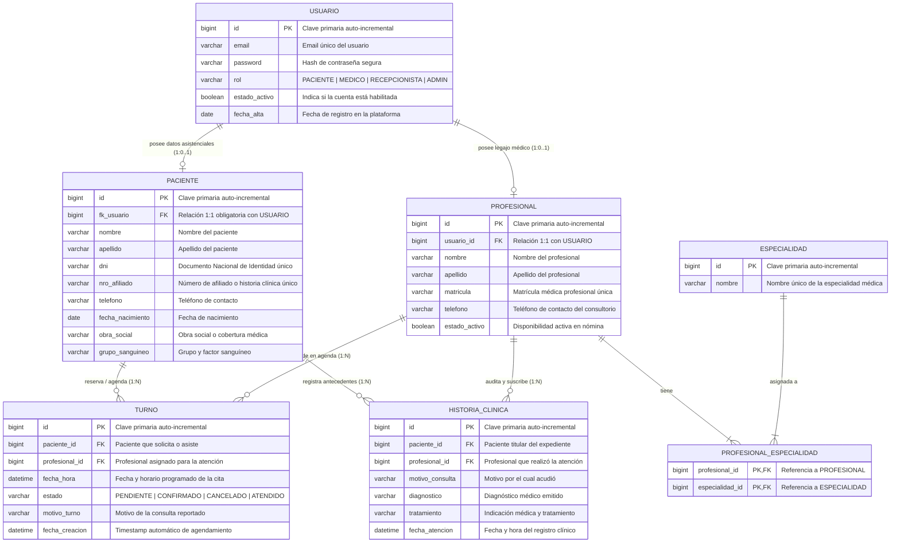

# Diagrama Entidad-Relación (DER) — Ecosistema de Salud Unificado (ESU)

Este documento especifica el **Diagrama Entidad-Relación (DER / ERD) oficial** del esquema de persistencia relacional en MySQL para el backend de ESU, derivado del mapeo JPA/Hibernate.

---

## 1. Diagrama Entidad-Relación (Notación Crow's Foot / Mermaid)

---

## 2. Diccionario de Datos y Reglas de Integridad Referencial

| Tabla | Clave Primaria (PK) | Claves Foráneas (FK) | Restricciones de Unicidad |
|---|---|---|---|
| `usuario` | `id` | - | `email` UNIQUE |
| `paciente` | `id` | `fk_usuario` → `usuario(id)` | `dni` UNIQUE, `nro_afiliado` UNIQUE, `fk_usuario` UNIQUE |
| `profesional` | `id` | `usuario_id` → `usuario(id)` | `matricula` UNIQUE, `usuario_id` UNIQUE |
| `especialidad` | `id` | - | `nombre` UNIQUE |
| `profesional_especialidad` | `(profesional_id, especialidad_id)` | `profesional_id` → `profesional(id)`, `especialidad_id` → `especialidad(id)` | PK compuesta |
| `turno` | `id` | `paciente_id` → `paciente(id)`, `profesional_id` → `profesional(id)` | - |
| `historia_clinica` | `id` | `paciente_id` → `paciente(id)`, `profesional_id` → `profesional(id)` | - |
