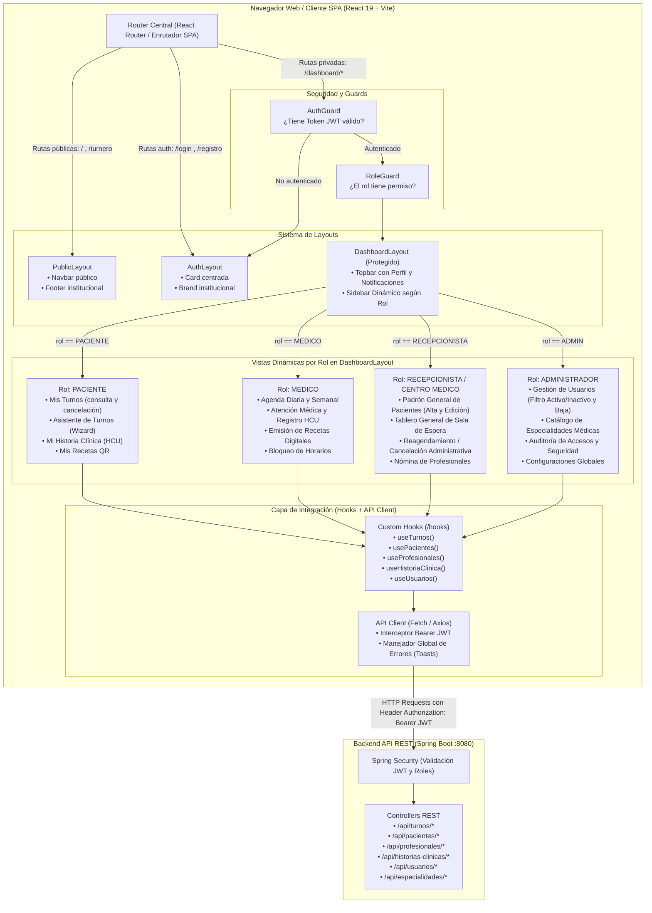
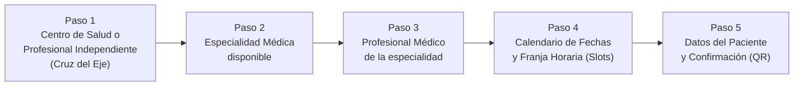

# Arquitectura Frontend y Control de Acceso por Roles (RBAC) — ESU

Este documento define la estructura oficial de la aplicación **Single Page Application (SPA)** de **Esu-Frontend**, especificando el sistema de Layouts unificados, la navegación adaptativa y la protección perimetral de rutas basada en roles (RBAC).

---

## 1. Diagrama de Navegación y Layouts (Mermaid)

---

## 2. Matriz de Acceso por Roles (RBAC Matrix)

| Módulo / Funcionalidad | Ruta Frontend | `PACIENTE` | `MEDICO` | `RECEPCIONISTA` | `ADMIN` |
|---|---|:---:|:---:|:---:|:---:|
| **Portal y Turnero Rápido** | `/` y `/turnero` | ✅ | ✅ | ✅ | ✅ |
| **Login y Recuperación** | `/login` | ✅ | ✅ | ✅ | ✅ |
| **Mis Turnos (Consulta/Cancelación)** | `/dashboard/mis-turnos` | ✅ | ❌ | ❌ | ❌ |
| **HCU Personal (Ver consultas)** | `/dashboard/mi-historial` | ✅ | ❌ | ❌ | ❌ |
| **Agenda y Sala de Consulta** | `/dashboard/agenda` | ❌ | ✅ | ❌ | ❌ |
| **Carga de Historia Clínica (Atención)** | `/dashboard/atencion/:pacienteId` | ❌ | ✅ | ❌ | ❌ |
| **Padrón Asistencial de Pacientes** | `/dashboard/pacientes` | ❌ | 👁️ (Lectura) | ✅ (CRUD) | ✅ |
| **Tablero de Recepción y Espera** | `/dashboard/recepcion` | ❌ | ❌ | ✅ | ✅ |
| **Reagendamiento y Cancelación Admin** | `/dashboard/turnos-admin` | ❌ | ❌ | ✅ | ✅ |
| **Nómina de Profesionales y Matrículas**| `/dashboard/profesionales` | ❌ | ❌ | ✅ | ✅ |
| **Gestión de Usuarios y Bajas** | `/dashboard/usuarios` | ❌ | ❌ | ❌ | ✅ |
| **Catálogo de Especialidades** | `/dashboard/especialidades`| ❌ | ❌ | ❌ | ✅ |

---

## 3. Principio de Layout Único y Desacoplamiento

1. **Sin aplicaciones separadas:** No existen dos aplicaciones Vite. El sistema es una única SPA unificada.
2. **Sidebar Dinámico:** El `Sidebar` lee el `user.rol` desde el `AuthContext` y filtra los ítems de navegación según la matriz RBAC.
3. **Smart Containers (`< 100 líneas`):** Cada vista es un contenedor que orquesta los custom hooks y delega la renderización a componentes atómicos en `/components`.

---

## 4. Flujo Canónico del Asistente de Turnos (Wizard de 5 Pasos)

El Turnero opera como un asistente por pasos secuenciales (Stepper) con validación progresiva y reducción de fricción cognitiva:

1. **Paso 1: Centro de Salud o Profesional Independiente (Filtro Cruz del Eje)**
   - Selector inicial obligatorio: permite elegir entre instituciones de salud (clínicas, sanatorios, dispensarios municipales de Cruz del Eje) o consultorios de profesionales independientes.
   - Búsqueda por nombre o zona geográfica dentro de Cruz del Eje.
2. **Paso 2: Especialidad Médica**
   - Muestra exclusivamente las especialidades disponibles y habilitadas en el centro o consultorio seleccionado en el Paso 1.
3. **Paso 3: Profesional de la Salud**
   - Muestra la nómina de médicos que ejercen dicha especialidad dentro de la institución seleccionada (nombre completo, matrícula médica provincial y días de atención).
4. **Paso 4: Calendario y Franja Horaria (Slots de Atención)**
   - Calendario mensual con días disponibles marcados.
   - Selección de slots horarios configurados (mañana / tarde) en bloques de 15 o 30 minutos.
5. **Paso 5: Identificación y Confirmación**
   - Carga de datos personales si no inició sesión (DNI numérico, Nombre, Apellido, Teléfono, Cobertura/Obra Social).
   - Resumen final del turno, confirmación y emisión del comprobante digital descargable con código QR de verificación.

