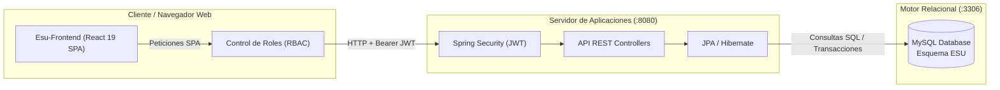

# Arquitectura del Sistema — Ecosistema de Salud Unificado (ESU)

Este directorio concentra la **especificación técnica y los diagramas estandarizados** del proyecto ESU, garantizando una única fuente de verdad para el diseño del backend, frontend, persistencia y control de accesos.

---

## 📑 Índice de Especificaciones y Diagramas

1. [📐 Diagrama de Clases UML (Dominio Java / Spring Boot)](./CLASS_DIAGRAM.md)
   - Especificación formal OMG con visibilidad, tipos de datos y relaciones de agregación, composición y asociación entre `Usuario`, `Paciente`, `Profesional`, `Turno`, `HistoriaClinica` y `Especialidad`.

2. [🗄️ Diagrama Entidad-Relación (DER / Modelo Físico MySQL)](./ER_DIAGRAM.md)
   - Notación Crow's Foot estándar para el esquema relacional en MySQL (`usuario`, `paciente`, `profesional`, `turno`, `historia_clinica`, `especialidad`, `profesional_especialidad`), incluyendo claves primarias (PK), foráneas (FK) y cardinalidades.

3. [🧭 Arquitectura Frontend y Navegación RBAC](./FRONTEND_RBAC_ARCHITECTURE.md)
   - Diseño de la Single Page Application (SPA) unificada en React 19 + TypeScript + Vite.
   - Sistema de Layouts (`PublicLayout`, `AuthLayout`, `DashboardLayout`) y matriz de control de acceso por roles (`PACIENTE`, `MEDICO`, `RECEPCIONISTA`, `ADMIN`).

4. [✨ Diagrama Interactivo de Arquitectura (Archify)](./esu_architecture.html)
   - Visualizador HTML autónomo generado con **Archify** (`esu_architecture.json`).
   - Soporta pan, zoom, navegación por capas (Frontend, Backend, Persistencia) y filtros dinámicos abriendo el archivo en cualquier navegador.

---

## 🏗️ Resumen Visual de la Arquitectura



---

## 🛠️ Cómo Visualizar y Actualizar

* **En GitHub:** Todos los diagramas `.md` contienen bloques `mermaid` que GitHub renderiza de forma nativa.
* **Visualizador Interactivo:** Abrir [esu_architecture.html](./esu_architecture.html) con doble clic en tu explorador o navegador web favorito.
* **Recompilar con Archify:**
  ```bash
  node .agents/skills/archify/bin/archify.mjs render architecture docs/architecture/esu_architecture.json docs/architecture/esu_architecture.html
  ```
